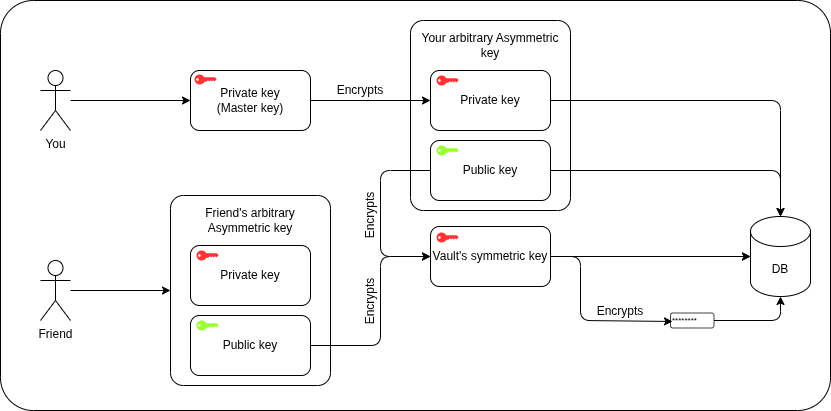

# HexVault

HexVault is an advanced, open-source, self-hostable password manager designed to put security and transparency back into the hands of the user.

## Why a new Password manager

Most commercial password managers block some important features like TOTP or Passkeys behind paid subscriptions. Moreover, we do not know how the data is stored, encrypted and used in these managers.

## Core features

- **Zero-knowledge architecture**: Backend and Database never sees personal information. This way, if anytime the database gets leaked, hackers will never have access to sensitive information.
- **End-to-end encryption**: All your passwords and sensitive data are encrypted on your device before being sent to the server, ensuring that only you have access to your information.
- **Data sovereignty**: You can self-host HexVault on your own server, giving you full control over your data and security. Sensitive data should be yours.
- **Open-source**: HexVault is open-source, allowing the community to audit, contribute, and ensure the highest standards of security and transparency.
- **Cross-platform**: Available as a browser extension and Android app, ensuring your passwords are accessible wherever you need them.

## Features roadmap

- **Vaults**: Create multiple vaults to organize your passwords and sensitive data, with support for custom fields and categories.
- **Master Password Rotation**: Change your Master Password without losing access to your vaults, ensuring continued security even if your Master Password is compromised.
- **Password Management**: Store and manage your passwords securely in vaults, with support for multiple vaults and sharing.
- **Secure passwords generator**: Generate strong, unique passwords for your accounts with customizable options (length, character types, etc.).
- **Password Health Analysis**: Analyze the strength of your passwords and provide recommendations for improving them.
- **TOTP Management**: Generate and store Time-based One-Time Passwords for two-factor authentication.
- **Passkeys Integration**: Support for WebAuthn and FIDO2 passkeys for passwordless authentication.
- **Credit Card Management**: Store and manage your credit card information securely in vaults.
- **SSH Keys Management**: Store and manage your SSH keys securely in vaults.
- **Biometric Authentication**: Enable biometric authentication (fingerprint, face recognition) for quick and secure access to your vaults.
- **Vault Sharing**: Share vaults securely with trusted users, allowing them to access shared credentials without compromising security.
- **Secure Notes**: Store and manage secure notes in vaults, with the same level of encryption and security as passwords.
- **Activity Logs**: Keep track of access and changes to your vaults with detailed activity logs.
- **More to come...**: We have many more features planned for the future, and we are open to suggestions from the community!

### Long term vision

- **Quantum-resistant cryptography**: As quantum computing advances, we plan to implement quantum-resistant cryptographic algorithms to ensure the long-term security of your data.

## Tech Stack

- **Backend**: Rust, Axum, SQLx, PostgreSQL.
- **Frontend/Extension**: React, TypeScript, Vite, Tailwind CSS (Manifest V3 for extension).
- **Crypto Engine**: Hybrid cryptography architecture (Argon2id for Master Key, AES-256-GCM for Symmetric Vault Keys, Asymmetric pairs for sharing).
- **Infrastructure**: Docker

## How does it work?

HexVault operates on a zero-knowledge principle, meaning that the server and database never have access to your plaintext passwords or sensitive data. Here's a high-level overview of how it works:

1. **User Authentication**: When you create an account, you generate a Master Password on your device. This password is never sent to the server. Instead, a derived key (using Argon2id) is used for authentication and encryption. After deriving this key, a random Asymmetric User Keypair is generated with CSPRNG (private key) + X25519 (public key). The public key is stored in the database while the private key is encrypted with the derived key (symmetric) and stored in the database as well. This double encryption is used for faster and safer Master Password rotation without compromising security. For logging in, the derived key is again hashed via SHA-256 and to send it as if it was a password and hash it again using argon2id in the server (for potential database steal), but the server never has access to the Master Password or the derived key in plaintext.

2. **Creating a Vault**: When you create a vault, a new Symmetric Vault Key is generated for that vault with a CSPRNG (Cryptographically Secure Pseudo-Random Number Generator). This key is encrypted with your public key and stored in the database. The vault's metadata (name, description, etc.) is also stored in the database. Each vault has its own Symmetric Vault Key to enable sharing (explained later).

3. **Adding Credentials**: When you add a new credential to a vault, the credential data is encrypted on your device using the vault's Symmetric Key with AES-256-GCM before being sent to the server. The server again only stores the encrypted data. Remember that the vault's Symmetric Key is encrypted with your public key, so only you can decrypt it with your private key, or if you shared the vault, the recipient can decrypt it with their private key.

4. **Accessing Credentials**: When you access your vault, the app retrieves the encrypted vault key from the server and decrypts it using your private key again with AES-256-GCM. Then, it uses the decrypted vault key to decrypt the credentials stored in that vault.

5. **Sharing Vaults**: If you choose to share a vault, the vault's Symmetric Key is encrypted with the recipient's public key and stored in the database. The recipient can then decrypt the vault key with their private key and access the shared vault. ONLY SHARE VAULTS WITH TRUSTED USERS, AS THEY CAN DECRYPT THE VAULT KEY AND ACCESS ALL CREDENTIALS IN THAT VAULT.

6. **Master Password Rotation**: If you need to change your Master Password, you can do so without losing access to your vaults. The new Master Password's derived key will be used to encrypt your arbitrary private key in the database (the one you use to decrypt your vault's symmetric keys), and the old derived key will be discarded. This way, even if your old Master Password was compromised, your vaults remain secure.

7. **Deleting a Vault**: When you delete a vault, the server removes the encrypted vault key and all associated credentials from the database. Since the data is encrypted, it cannot be recovered once deleted. If the vault was shared, all the recipients will lose access to the vault as well.

8. **Deleting an Account**: When you delete your account, all your vaults and credentials are permanently deleted from the server. Since the data is encrypted, it cannot be recovered once deleted. If you shared any vaults, all the recipients will lose access to those vaults as well.

### Keys diagram

